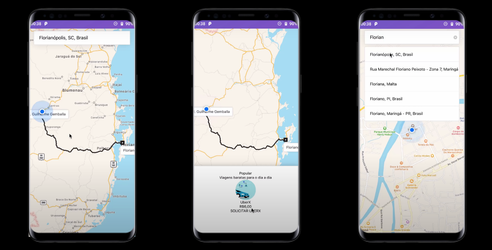

# Uber Clone (2019)
<p align="center">
  

  
  
  <a href="https://github.com/Relirk/uber-clone-mobile/commits/master">
    
  </a>

  <a href="https://github.com/Relirk/uber-clone-mobile/issues">
    
  </a>

  
</p>

:iphone: React Native application Google Maps and Geolocation

- Based on the study of the [Rocketseat video](https://www.youtube.com/watch?v=bg-U0xZwcRk)

###



### Tools used:

- [Rect Native](https://reactnative.dev/)
- [React Native Maps](https://github.com/react-native-community/react-native-maps)
- [Axios](https://github.com/axios/axios)

### Setting up your api key

```javascript
// src/components/Search/index.js
query={{
  key: "YOUR_API_KEY",
  language: "pt",
}}

// src/components/Directions/index.js
const Directions = ({ destination, origin, onReady }) => (
  <MapViewDirections
    destination={destination}
    origin={origin}
    onReady={onReady}
    apikey="YOUR_API_KEY"
    strokeWidth={3}
    strokeColor="#222"
  />
);
```

```xml
<!-- AndroidManifest.xml -->
<meta-data
    android:name="com.google.android.geo.API_KEY"
    android:value="YOUR_API_KEY"/>
```

### Running Locally

```sh
# Install dependencies
yarn install

# Start the metro bundler into a new terminal tab
yarn start

# Start the app android
react-native run-android

# Start the app ios
react-native run-ios --device
```
